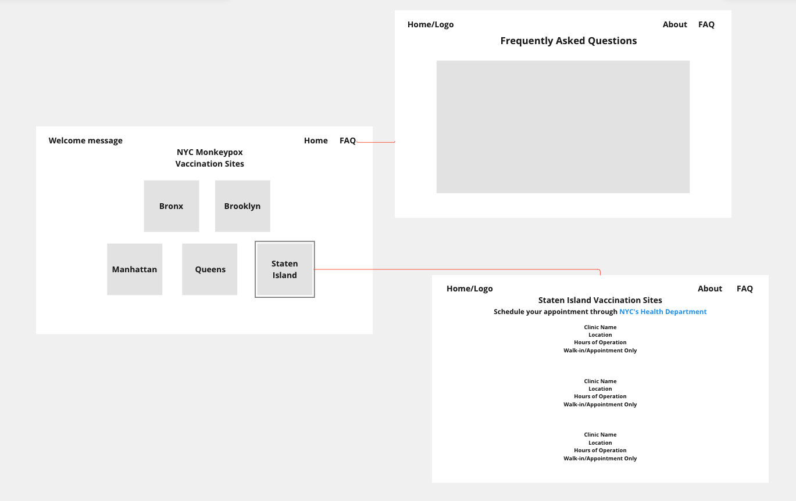
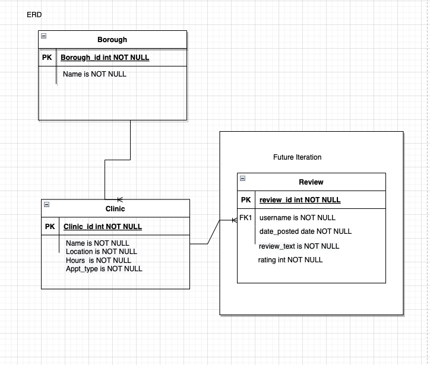
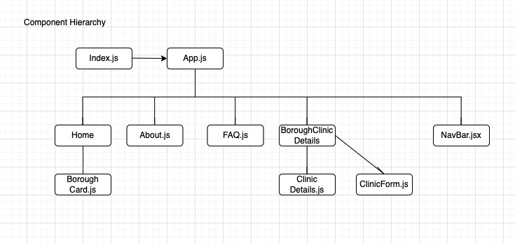
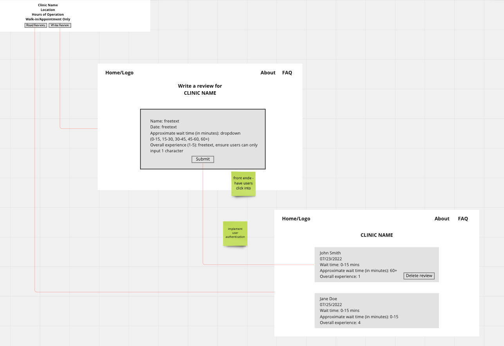

# NYC Monkeypox Vaccination Sites

## Date: 07/24/2022

#### By: Yangtsel Sherap

**[Deployed Website](https://boiling-beach-15847.herokuapp.com/borough/62dff96edb397f1ee0accc8c) | [GitHub](https://github.com/y-sherap) | [LinkedIn](https://www.linkedin.com/in/yangtsel-sherap-51605947/) | [Trello](https://trello.com/b/pHVFTTdq/project-2)**

---

---

#### _Description_

Developed and deployed a full-stack web application that serves as a repository for current Monkeypox vaccination sites in NYC.

View the project [HERE](https://boiling-beach-15847.herokuapp.com/borough/62dff96edb397f1ee0accc8c).

---

#### _Technologies Used_

- React.js
- MongoDB
- Mongoose/Express
- Javascript
- Node.js
- CSS
- HTML
- Heroku
- Atlas

---

#### _Project Overview_
This application is built for a health systems administrator who is in charge of updating clinics currently administering the Monkeypox Vaccine. 

The user is able to navigate between different boroughs and edit, delete, or add clinics

---

### **_Screenshots_**

#### **Spec**

#### **Entity Relationship Diagram**

#### **Component Hierarchy Diagram**

---

#### _Future Updates_

- [ ] Create a page to display reviews by clinic
- [ ] Include live statistics of cases detected
- [ ] Create a side bar
- [ ] Add additional clinics

#### **Spec of future iteration**

---

#### **_Resources_**

- Draw.io
- Heroku

---
