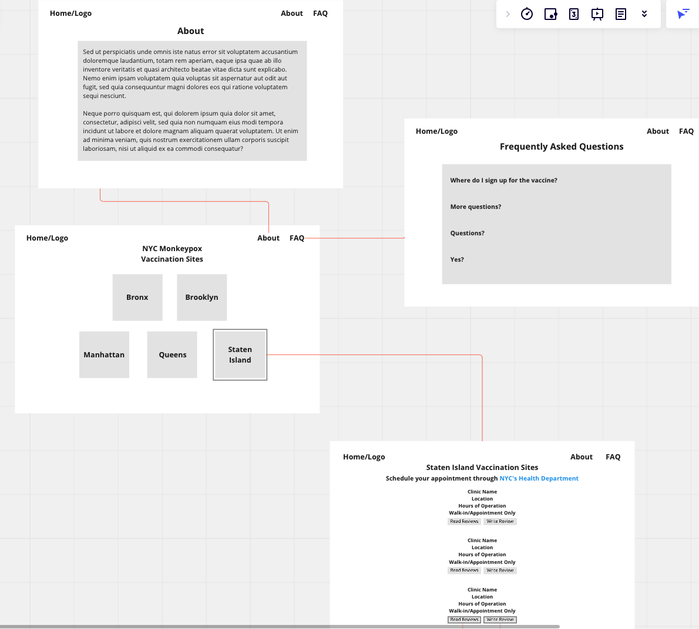
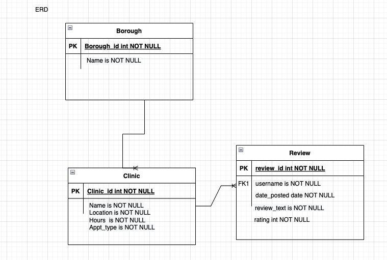
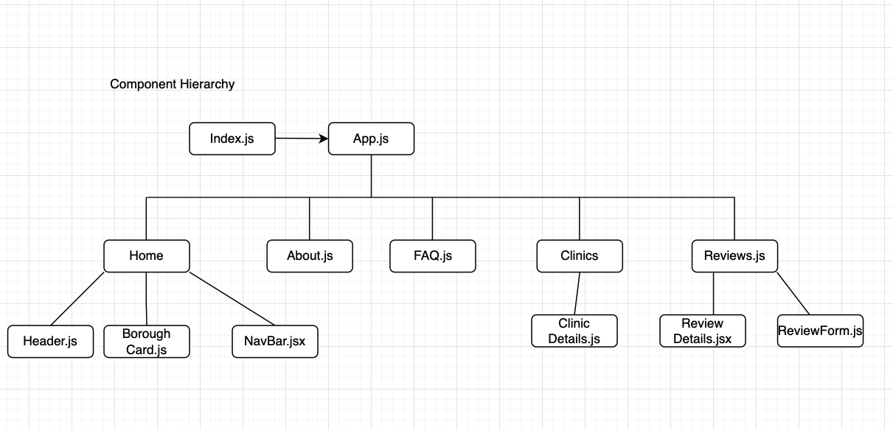

# NYC Monkeypox Vaccination Sites

## Date: 07/24/2022

#### By: Yangtsel Sherap

**[Deployed Website](ADD HEROKU LINK HERE) | [GitHub](https://github.com/y-sherap) | [LinkedIn](https://www.linkedin.com/in/yangtsel-sherap-51605947/) | [Trello](https://trello.com/b/pHVFTTdq/project-2)**

---

---

#### _Description_

Developed and deployed a full-stack web application that serves as a repository for current Monkeypox vaccination sites in NYC.

View the project [here](ENTER HERUKO LINK).

###### _Deployed Homepage_

ADD VIDEO HERE

---

#### _Technologies Used_

- React.js
- MongoDB
- Mongoose/Express
- Javascript
- Node.js
- CSS
- HTML
- Heroku
- Atlas

---

#### _Project Overview_

---

### **_Screenshots_**

#### **Spec**

#### **Entity Relationship Diagram**

#### **Component Hierarchy Diagram**

---

#### _Future Updates_

- [ ] Include live statistics of cases detected

---

#### **_Resources_**

- Draw.io
- Heroku

---
